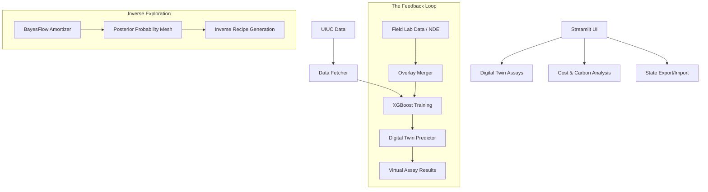

# 🧪 Digital Lab-Twin Assays

A high-fidelity framework for concrete mix design validation, providing **Virtual Assays** as a powerful alternative to costly destructive testing. By combining **XGBoost** predictive modeling, **Multi-Objective Genetic Algorithms**, and **BayesFlow** amortized inference, we turn concrete design into a precise digital discipline.

---

## 🚀 Quickstart

### 1. Installation
```bash
git clone <repository-url>
cd 2026-new-concrete-experiments
pip install -r requirements.txt
```

### 2. Dataset Initialization
```bash
python -m src.data_fetcher --check
```

### 3. Launch the Lab-Twin
```bash
streamlit run app.py
```

---

## 🏗️ The "Digital Lab-Twin" Concept

Traditional concrete validation relies on **Destructive Testing**—pouring cylinders, waiting 28 days, and crushing them. This is slow, expensive, and resource-heavy. 

Our **Digital Lab-Twin Assays** offer:
- **Instant Validation**: Predict performance in milliseconds across 8+ parameters.
- **Inverse Design**: Use **BayesFlow** to tell the model the strength you need, and let it generate the optimal chemical recipes.
- **Sustainable Optimization**: Minimize carbon footprint and material cost simultaneously.

---

## 🛠️ Key Features

### 1. 🔄 Adaptive Feedback Loop
The Lab-Twin isn't static. It features a built-in feedback loop for **NDE (Non-Destructive Evaluation)** and actual lab results. 
- **Retraining**: Upload field results to the "Feedback Loop" tab to refine the Digital Twin's accuracy.
- **Calibration**: The model evolves with your specific regional materials and admixture performance.

### 2. 💰 Financial & Carbon Intelligence
- **Cost Metrics**: Dynamic unit cost tracking per material (Cement, Slag, SP).
- **Economic Optima**: Find the mix that hits your structural targets at the lowest possible price point.
- **LCA Factors**: Embodied carbon calculations integrated into every virtual assay.

### 3. � Assay Persistence
- **State Export**: Save your entire lab setup (mixes, costs, and configurations) as a JSON file.
- **Collaborative Flow**: Share `.json` assay states with teammates to reproduce exact virtual conditions.

---

## 🛠️ Technical Approach

1.  **Forward Twin (XGBoost)**: A high-performance regressor trained on the UIUC dataset (R²: 0.92).
2.  **Inverse Engine (BayesFlow)**: Normalizing Flows for global posterior mapping.
3.  **Pareto Search**: Multi-objective optimization balancing Strength vs. Cost vs. Carbon.

### Workflow Visualization



---

## 🚀 Future Roadmap

### 1. Hybrid Metaheuristics (Simulated Annealing & ACO)
Refining the search for "economic sweet spots" within complex admixture spaces.

### 2. Bayesian Active Learning
The system will explicitly suggest which lab tests should be run next to most effectively "shrink" the empty spaces in the design manifold.

### 3. BIM & Supply Chain Integration
Connecting mix designs directly to structural schedules and supplier pricing APIs.

---
*Transforming concrete from a black box into a digital precision asset.*
