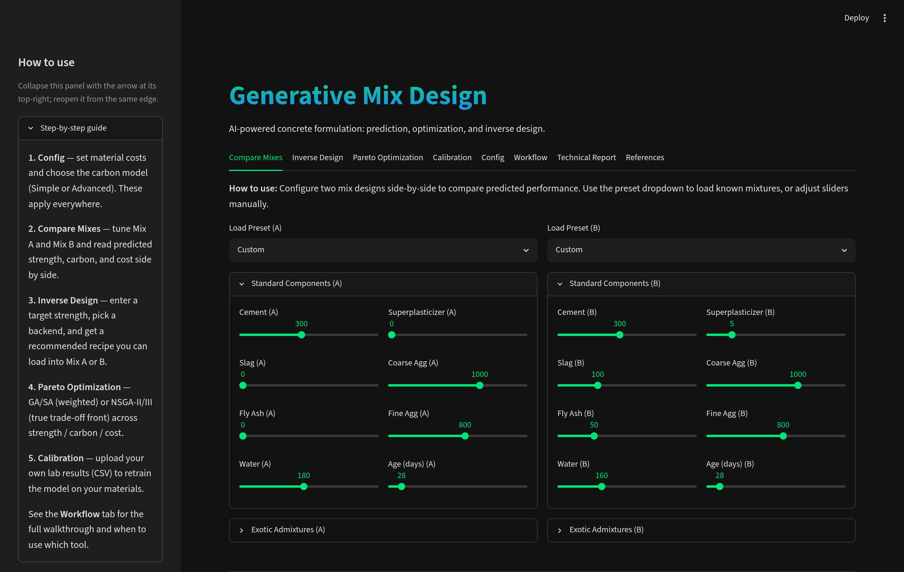
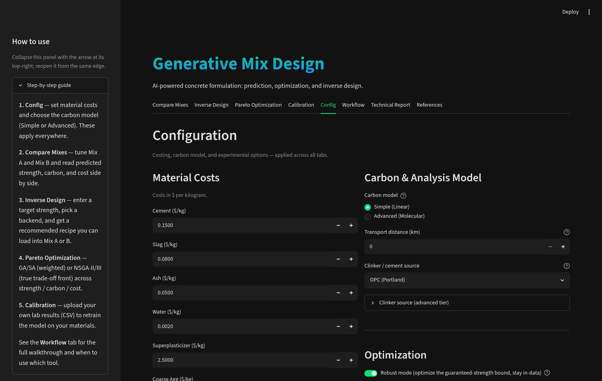
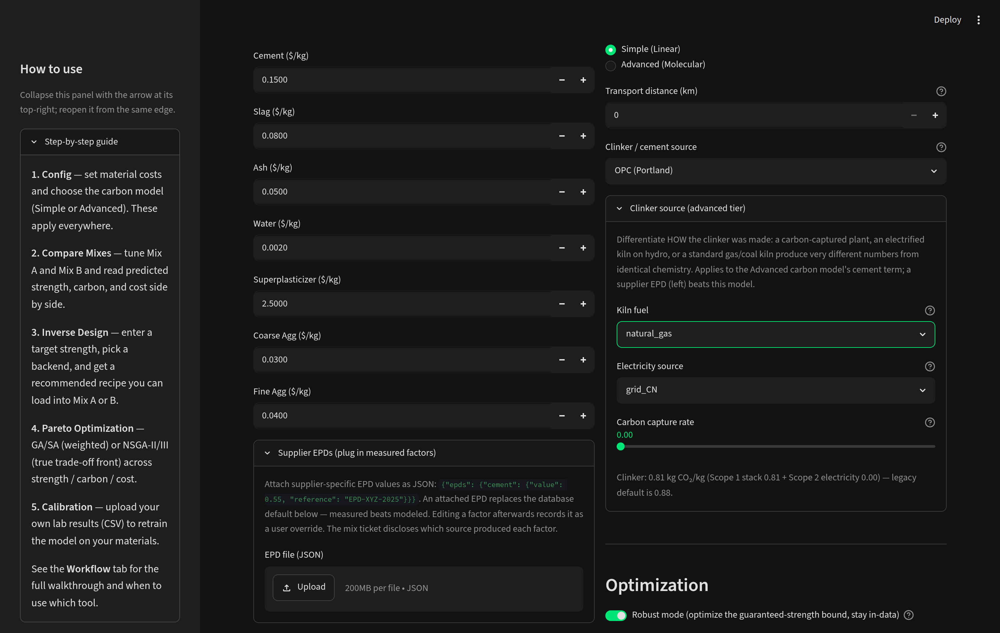
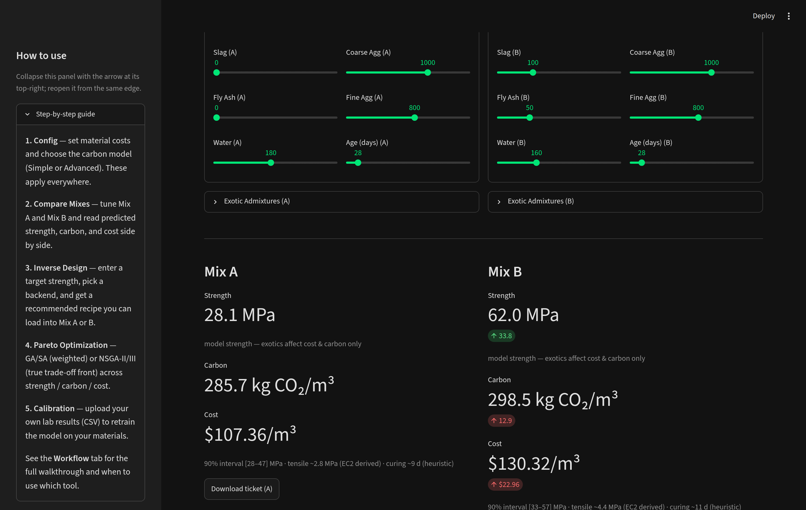
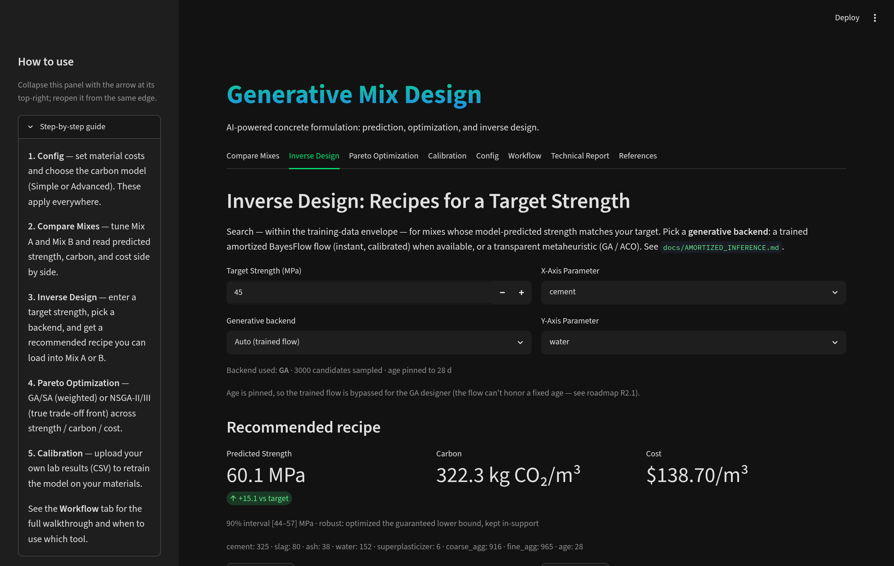
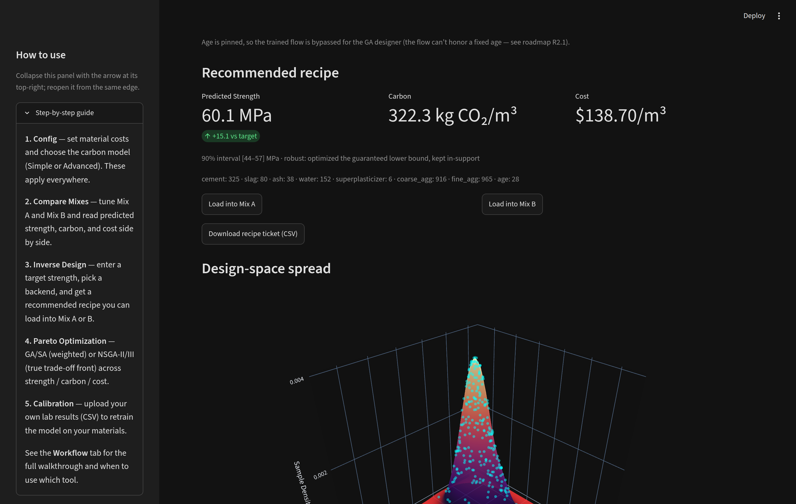
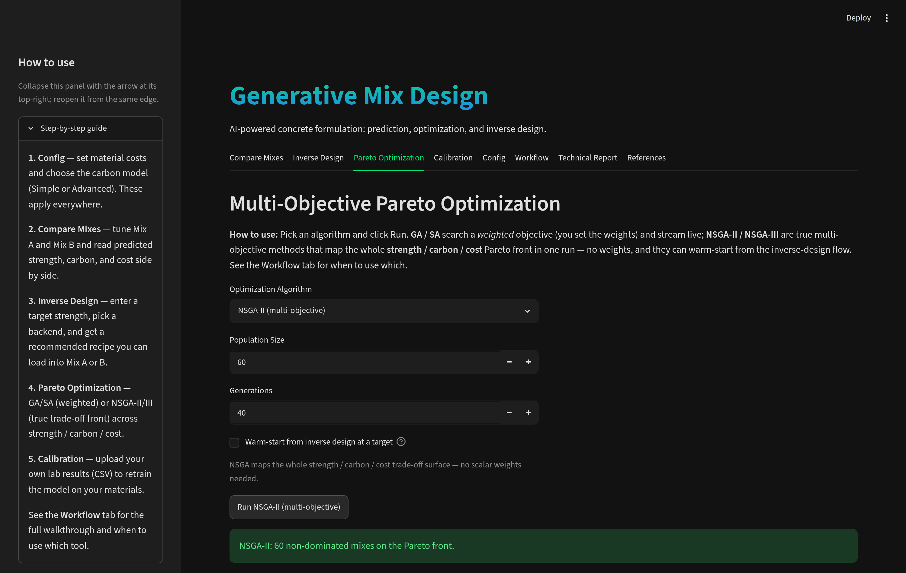
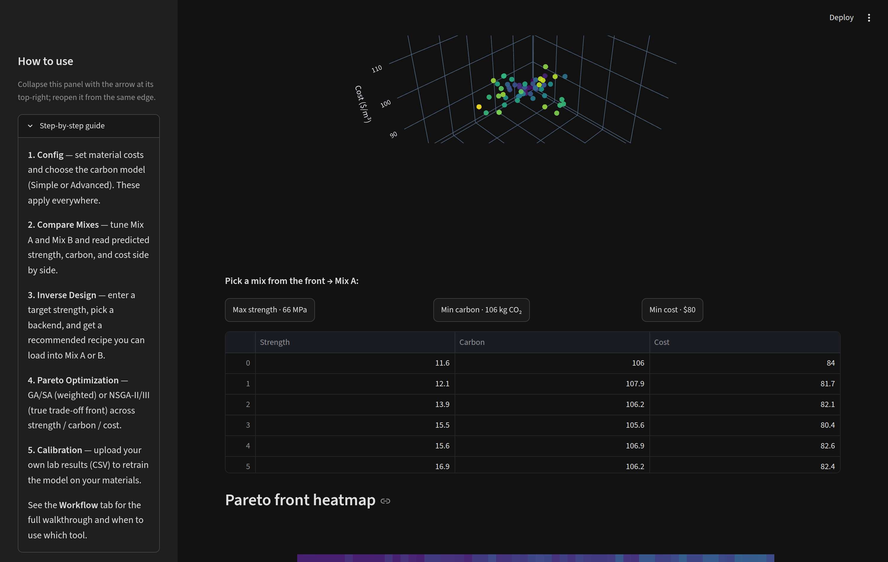
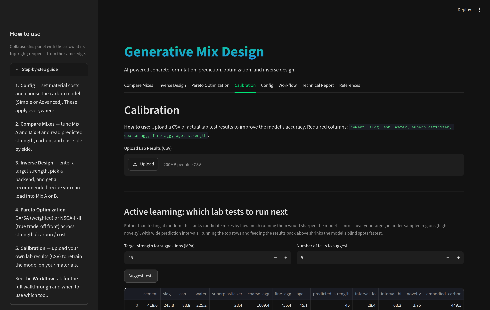
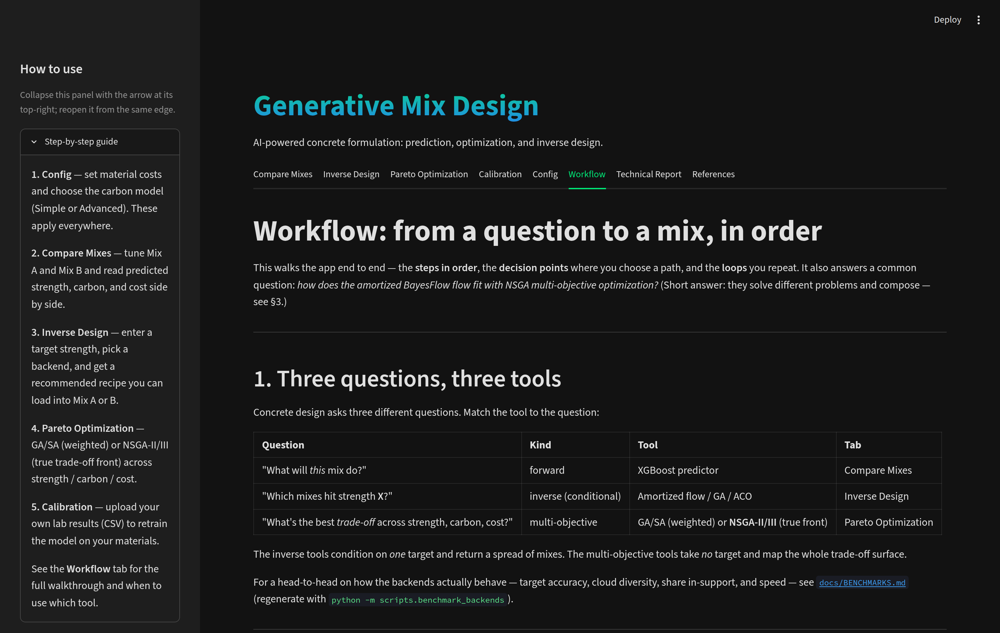

# Tutorial: a guided tour of Generative Mix Design

A walkthrough of the app in workflow order, with screenshots from a live session.
Launch it with `streamlit run app.py` (see the [README](../README.md) Quickstart), or
follow along headlessly with the [CLI](#9-no-browser-the-cli) at the end. For the
reasoning behind each tool, see [`WORKFLOW.md`](WORKFLOW.md); for what the numbers
rest on, see [`TECHNICAL_REPORT.md`](TECHNICAL_REPORT.md).

---

## 1. First look



The app opens on **Compare Mixes** with the **How to use** sidebar expanded — a
five-step guide that mirrors this tutorial. The eight tabs across the top are, in the
order you will usually visit them: Compare Mixes, Inverse Design, Pareto Optimization,
Calibration, then Config (settings), Workflow (the in-app version of this walkthrough),
Technical Report, and References.

Two things to know before touching anything:

- **One model, everywhere.** Every tab reads the same strength predictor, the same
  carbon path, and the same cost table. Change a cost or a carbon factor in Config and
  every number in the app moves with it.
- **The sidebar also holds session save/restore** — export your complete setup (mixes,
  costs, factors, attached EPDs) as one JSON file and re-import it later. That same
  file drives the CLI.

## 2. Config — set the ground rules first



Costs are in $/kg; emission factors (kg CO₂/kg) live in the expander below them, with
ICE-database defaults you can edit per region. On the right: the carbon model tier
(**Simple** mass-x-factor vs **Advanced** clinker chemistry), transport distance, and
two switches that shape everything downstream:

- **Robust mode** (default ON): optimizers target the *guaranteed* strength — the
  calibrated 90% lower bound — and stay inside the trusted data region, instead of
  chasing a confident-looking mean into extrapolated corners.
- **Fix design age** (default ON): age is a design *condition*, not a variable — the
  optimizer cannot hit a strength target by quietly prescribing a 90-day cure.

### Plugging in supplier EPDs and differentiating the clinker



Two panels turn the carbon accounting from indicative to procurement-grade:

- **Supplier EPDs** — attach measured, supplier-specific factors as JSON
  (`{"epds": {"cement": {"value": 0.55, "reference": "EPD-XYZ-2025"}}}`). An attached
  EPD replaces the database default — measured beats modeled — and every mix ticket
  discloses, per material, whether its factor came from an EPD, the database, or a
  manual override.
- **Clinker source** — identical cement chemistry can differ several-fold in carbon
  depending on how the clinker was made. Pick the kiln fuel, the electricity source
  (powering an electrified kiln and/or a capture plant), and the capture rate; the
  caption shows the resulting kg CO₂ per kg clinker **split into Scope 1 (stack) and
  Scope 2 (electricity)** — in the screenshot, a natural-gas kiln with no capture:
  0.81 kg/kg, all Scope 1. Set capture to 0.9 on hydro power and it drops to ~0.08.

## 3. Compare Mixes — two candidates, side by side



Tune Mix A and Mix B with the sliders (or load a dataset preset). The result cards
show predicted strength with the **calibrated 90% interval**, derived tensile (EC2),
a curing heuristic, embodied carbon, and cost — Mix B's deltas are relative to A.
If a mix drifts outside the well-sampled data region you get an explicit
extrapolation warning, and a workability flag when the w/b ratio looks unpumpable.

**Download ticket (A/B)** exports the mix as a CSV *mix ticket*: recipe, predictions
with interval, a carbon breakdown that reconciles exactly to the displayed total,
cost breakdown, the carbon provenance rows, the active config, and the standing
validate-before-use disclaimer. It is the artifact you hand to a lab or a supplier.

## 4. Inverse Design — recipes for a target



Enter a target strength and pick a generative backend — the trained amortized flow
when available, or the transparent GA / ACO metaheuristics. The caption always states
**which backend actually ran** and why (here: age is pinned, so the flow is bypassed
for the GA). With robust mode ON, the recommended recipe is one whose *guaranteed
lower bound* meets the target — which is why the mean prediction reads high: the
interval's lower edge (44 MPa in the screenshot) is what tracks the 45 MPa target.



Below the recipe, the **design-space spread** shows the whole cloud of candidate
mixes consistent with your target — inverse design returns a *distribution*, not one
answer. Load any recipe into Mix A/B for closer inspection, or download its ticket
directly.

## 5. Pareto Optimization — the whole trade-off surface



When there is no single target — you want the best achievable *trade-offs* across
strength, carbon, and cost — run a true multi-objective method. NSGA-II/III map the
whole Pareto front in one run, no weights to guess; GA/SA remain for the weighted,
watch-it-converge experience.



The result: a 3D front you can rotate, one-click picks for the max-strength /
min-carbon / min-cost corners (each loads straight into Mix A), the front as a table,
and a parameter heatmap of every non-dominated mix. With robust mode ON the entire
front is in-support and volume-balanced by construction.

## 6. Calibration — make the model yours



The model ships trained on the UCI dataset (1998, Taiwan). Upload your own lab
results as CSV and retrain — the app then reflects *your* materials, and tracks
accuracy across retrains. Below the upload, **active learning** answers "which tests
should the lab run next?": it ranks candidate mixes by how much testing them would
sharpen the model (near your target, wide interval, under-sampled region) and gives
you the list as a CSV. Run the top rows, feed the results back in, repeat — each loop
shrinks the model's blind spots where it matters to you.

## 7. Workflow — the map on the wall



The **Workflow** tab renders the full end-to-end walkthrough — which question calls
for which tool, in what order, with the decision points and loops. The
[backend benchmarks](BENCHMARKS.md) back "when to use which" with measured numbers.

## 8. Save your session

Sidebar → **Session save / restore** → *Export Session (JSON)*. The file carries both
mixes, costs, carbon factors, exotic dosings, and attached EPDs; importing it restores
all of them — including into the sliders and factor editors — in one step.

## 9. No browser: the CLI

Everything above runs headless against the same code paths, using the session export
as the project config:

```bash
python -m src.cli predict --mix mix.json --config gmd_session.json --ticket out.csv
python -m src.cli design  --target 45 --backend ga --age 28
python -m src.cli pareto  --algorithm nsga2 --out front.csv
python -m src.cli predict --mix mix.json --epd supplier_epds.json   # EPD factors + provenance
```

Useful for scoring a batch of bid mixes under one project config, CI checks, or
wiring the tool into another system. See [`specs/R5-operability.md`](specs/R5-operability.md).

---

## Regenerating the screenshots

The images in `docs/images/` were captured from a live run (Playwright driving
Chromium against `streamlit run app.py`, 1500x950 viewport at 2x). If the UI changes,
recapture the same ten views and keep the filenames — this document references them
by name.

*All predictions are design-exploration aids: validate physically (ASTM/EN) before
any structural use.*
