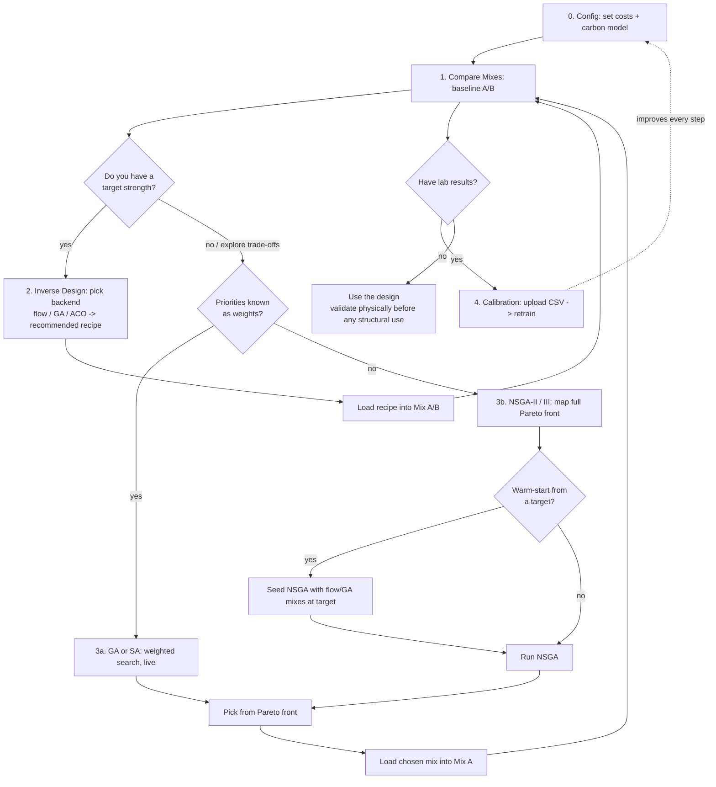

# Workflow: from a question to a mix, in order

This walks the app end to end — the **steps in order**, the **decision points** where you
choose a path, and the **loops** you repeat. It also answers a common question: *how does the
amortized BayesFlow flow fit with NSGA multi-objective optimization?* (Short answer: they solve
different problems and compose — see §3.)

---

## 1. Three questions, three tools

Concrete design asks three different questions. Match the tool to the question:

| Question | Kind | Tool | Tab |
|---|---|---|---|
| "What will *this* mix do?" | forward | XGBoost predictor | Compare Mixes |
| "Which mixes hit strength **X**?" | inverse (conditional) | Amortized flow / GA / ACO | Inverse Design |
| "What's the best *trade-off* across strength, carbon, cost?" | multi-objective | GA/SA (weighted) or **NSGA-II/III** (true front) | Pareto Optimization |

The inverse tools condition on *one* target and return a spread of mixes. The multi-objective
tools take *no* target and map the whole trade-off surface.

For a head-to-head on how the backends actually behave — target accuracy, cloud diversity,
share in-support, and speed — see [`docs/BENCHMARKS.md`](BENCHMARKS.md) (regenerate with
`python -m scripts.benchmark_backends`).

---

## 2. The workflow, in order

**Step 0 — Config.** Set material **costs** and choose the **carbon model** (Simple linear vs
Advanced clinker chemistry). These apply across every tab, so set them first.

**Step 1 — Compare Mixes (baseline).** Tune Mix A and Mix B; read predicted strength, carbon,
cost, uncertainty side by side. This is your reference point and where recipes land.

**Decision — do you have a target strength?**

- **Yes → Step 2, Inverse Design.** Enter the target, pick a backend:
  - **Amortized flow** — instant, calibrated (when trained). Best for fast "what mixes give 45 MPa?"
  - **GA / ACO** — transparent, no TensorFlow; also honor a carbon budget.

  Take the **recommended recipe**, load it into Mix A/B, and go back to Compare. *(Loop: adjust
  target → new recipe → compare.)*

- **No, or you want the whole trade-off → Step 3, Pareto Optimization.**

  **Decision — do you know your priorities as weights?**
  - **Yes → GA / SA (3a).** A weighted objective (strength − w·carbon − w·cost) with live
    convergence, violin, and Pareto plots. Good when you can state the trade-off up front.
  - **No → NSGA-II / NSGA-III (3b).** True multi-objective search that returns the whole
    **non-dominated Pareto front** — no weights. Use when you want to *see* the trade-offs before
    committing to a priority.

  **Decision — warm-start?** NSGA can **seed its initial population from the inverse-design flow**
  at a target strength, so it starts from realistic, in-distribution mixes and converges faster
  (see §3). Then pick a mix from the front (max-strength / min-carbon / min-cost, or any row),
  load it into Mix A, and return to Compare.

**Step 4 — Calibration (the improvement loop).** Upload real lab results (CSV with the 9 model
columns). They append to a local overlay and retrain the predictor on *your* materials — which
improves **every** downstream step (prediction, inverse design, Pareto). This is the outer loop
that makes the tool better over time.

---

## 3. How the amortized flow and NSGA fit together

They answer **different** questions, so they don't compete:

- **Amortized flow (inverse design).** Conditional: `p(mix | target strength)`. One target in,
  a spread of mixes out, instantly. It does **not** optimize carbon/cost trade-offs — it samples
  the manifold of mixes at a strength.
- **NSGA-II / III (multi-objective).** Unconditional: find the **Pareto front** across strength,
  carbon, and cost simultaneously. No single target, no weights — it maps the whole trade-off
  surface.

They **compose** in two ways:

1. **Flow → NSGA warm-start.** Use the flow to generate realistic, in-envelope mixes near a
   strength of interest, and hand them to NSGA as its initial population. NSGA then explores the
   carbon/cost trade-offs *around* that region faster and without wandering out of distribution.
   (The "Warm-start from inverse design" checkbox in the Pareto tab does exactly this.)
2. **NSGA → flow drill-down.** Pick a promising point on the NSGA front, read its strength, and
   use the flow to enumerate *many* alternative recipes that hit that same strength — giving you
   substitutes for the single front point.

Rule of thumb: **flow when you have a target and want speed; NSGA when you want to see the whole
trade-off; warm-started NSGA when you want both.**

> Note: the GA/SA "Pareto" view scalarizes with weights and drives a single search direction, so
> its live scatter is the *evaluated cloud*; the true front is extracted as the non-dominated
> subset. NSGA is the principled way to populate the front directly.

---

## 4. The loops, summarized

- **Design loop:** Compare ⇄ Inverse Design (adjust target → recipe → compare).
- **Explore loop:** Compare ⇄ Pareto (map front → pick → compare).
- **Improvement loop:** Calibration → retrain → *every* step gets better. Run it whenever you
  collect new lab data.

Always close with physical validation (ASTM/EN) before any structural use.
